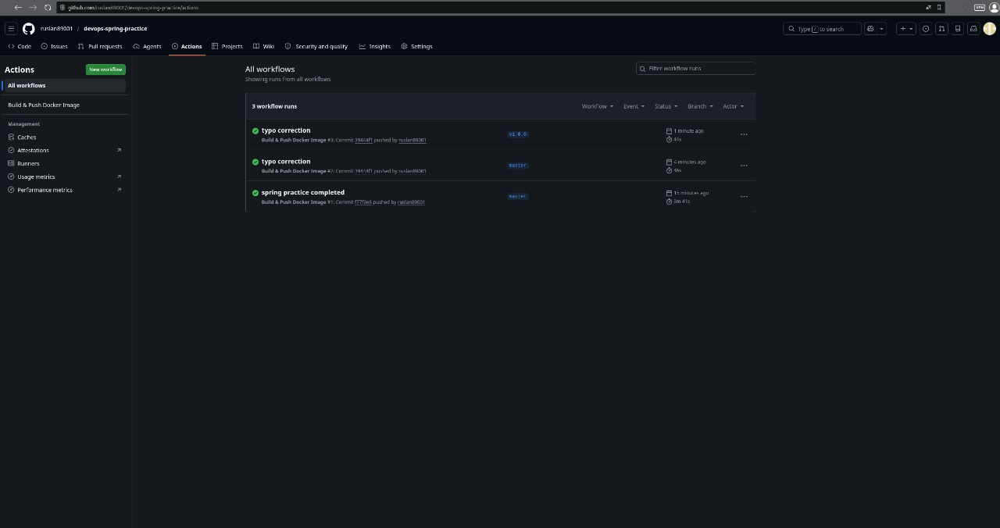
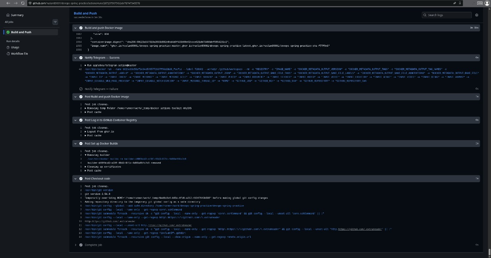
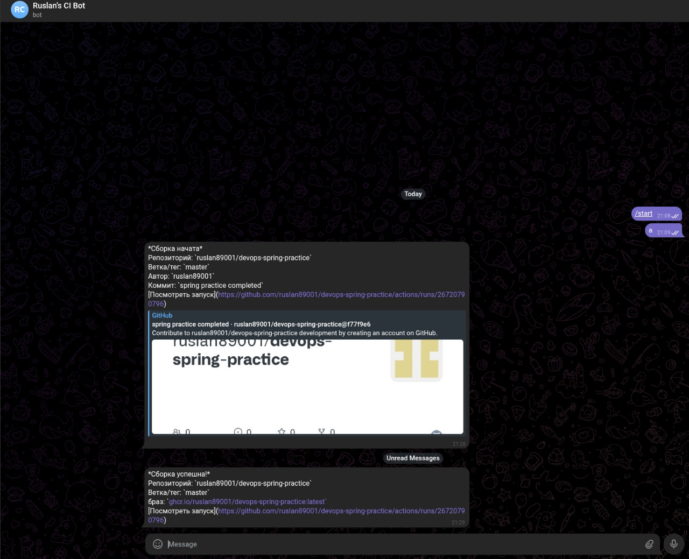
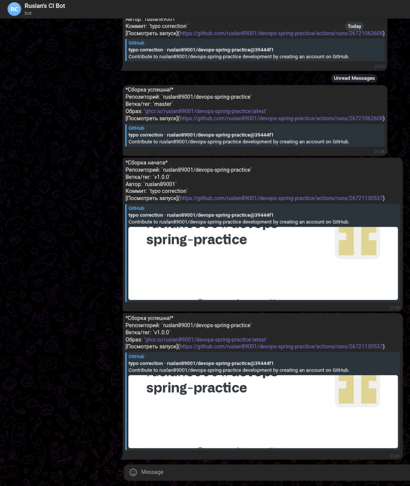
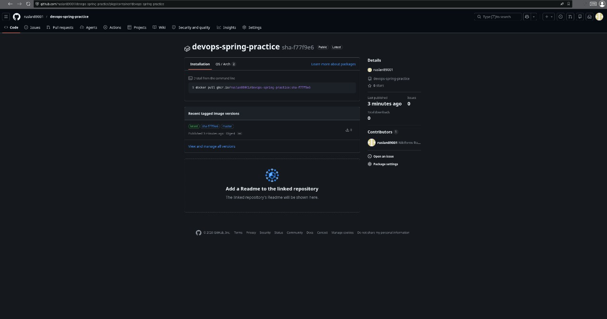
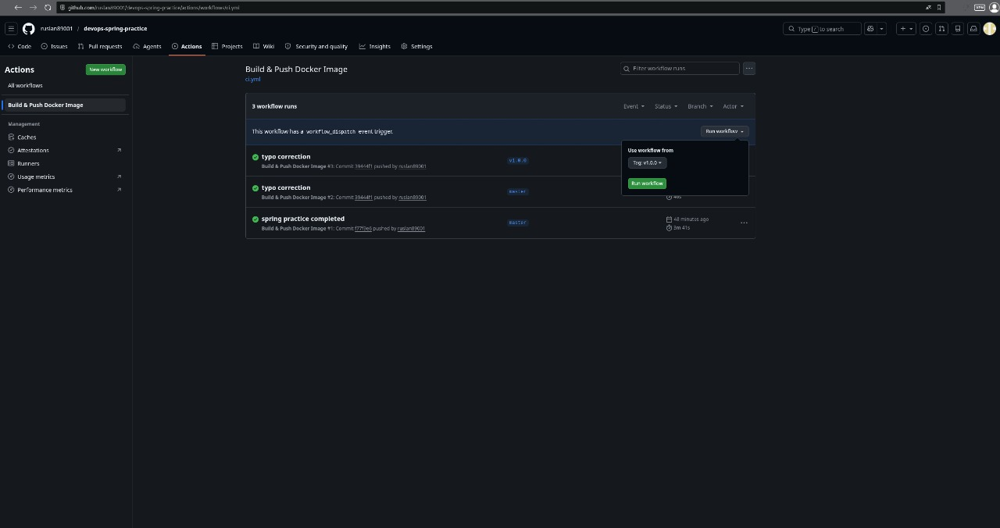
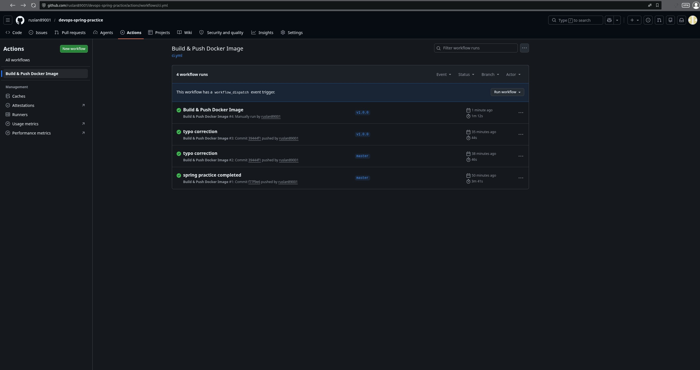

# devops-spring-practice

Веб-приложение для бронирования коворкинг-пространств на Symfony PHP. Упаковано в Docker-контейнеры с централизованным сбором логов через **Loki** и визуализацией в **Grafana**.

***

## Стек

- **Приложение**: Symfony 6 + PHP 8.2 + Nginx
- **База данных**: PostgreSQL 16
- **Логирование**: Grafana Loki + Promtail
- **Визуализация**: Grafana 11
- **Оркестрация**: Docker Compose

***

### Зависимости контейнеров

- `devops-project` — основное приложение (Symfony), порт `8080`
- `postgres:16-alpine` — база данных
- `grafana/loki:3.0.0` — сбор логов, порт `3100`
- `grafana/grafana:11.0.0` — дашборд логов, порт `3000`

---

## CI/CD Pipeline

### Триггеры

| Событие | Когда срабатывает |
|---------|------------------|
| `push` в ветку `master` | При каждом коммите в основную ветку |
| `push` тега `v*` | При создании тега релиза, например `v1.0.0` |
| `workflow_dispatch` | Ручной запуск через интерфейс GitHub Actions |

### Принцип автоматической сборки

При коммите в `master` или создании тега GitHub Actions автоматически запускает pipeline:

1. **Уведомление в Telegram** — сборка начата (репо, ветка, автор, коммит)
2. **Checkout** — клонирование кода репозитория
3. **Docker Buildx** — настройка расширенного сборщика образов
4. **Login to GHCR** — авторизация в GitHub Container Registry через `GITHUB_TOKEN`
5. **Extract metadata** — формирование тегов образа
6. **Build & Push** — сборка Docker-образа и публикация в registry
7. **Уведомление в Telegram** — успех ✅ или провал ❌

### Принцип ручной сборки

Перейти в **Actions → Build & Push Docker Image → Run workflow** → выбрать ветку → нажать **Run workflow**.  
Pipeline выполняется идентично автоматическому.

### Теги образов

При каждом запуске создаются следующие теги:

| Тег | Когда создаётся |
|-----|----------------|
| `master` | Push в ветку `master` |
| `v1.0.0` | Push тега `v1.0.0` |

### Где хранятся результаты

Собранные Docker-образы хранятся в **GitHub Container Registry**:  
`ghcr.io/ruslan89001/devops-spring-practice`

---

## Листинг автоматизации

### `.github/workflows/ci.yml`

```yaml
name: Build & Push Docker Image

on:
  push:
    branches:
      - master
    tags:
      - 'v*'
  workflow_dispatch:

env:
  REGISTRY: ghcr.io
  IMAGE_NAME: ${{ github.repository }}

jobs:
  build:
    name: Build and Push
    runs-on: ubuntu-latest

    permissions:
      contents: read
      packages: write

    steps:
      - name: Checkout code
        uses: actions/checkout@v4

      - name: Notify Telegram — Build started
        uses: appleboy/telegram-action@master
        with:
          to: ${{ secrets.TELEGRAM_CHAT_ID }}
          token: ${{ secrets.TELEGRAM_BOT_TOKEN }}
          message: |
            *Сборка начата*
            Репозиторий: `${{ github.repository }}`
            Ветка/тег: `${{ github.ref_name }}`
            Автор: `${{ github.actor }}`
            Коммит: `${{ github.event.head_commit.message }}`
            [Посмотреть запуск](${{ github.server_url }}/${{ github.repository }}/actions/runs/${{ github.run_id }})

      - name: Set up Docker Buildx
        uses: docker/setup-buildx-action@v3

      - name: Log in to GitHub Container Registry
        uses: docker/login-action@v3
        with:
          registry: ${{ env.REGISTRY }}
          username: ${{ github.actor }}
          password: ${{ secrets.GITHUB_TOKEN }}

      - name: Extract metadata
        id: meta
        uses: docker/metadata-action@v5
        with:
          images: ${{ env.REGISTRY }}/${{ env.IMAGE_NAME }}
          tags: |
            type=ref,event=branch
            type=ref,event=tag
            type=sha,prefix=sha-
            type=raw,value=latest,enable={{is_default_branch}}

      - name: Build and push Docker image
        id: build
        uses: docker/build-push-action@v5
        with:
          context: .
          push: true
          tags: ${{ steps.meta.outputs.tags }}
          labels: ${{ steps.meta.outputs.labels }}
          cache-from: type=gha
          cache-to: type=gha,mode=max

      - name: Notify Telegram — Success
        if: success()
        uses: appleboy/telegram-action@master
        with:
          to: ${{ secrets.TELEGRAM_CHAT_ID }}
          token: ${{ secrets.TELEGRAM_BOT_TOKEN }}
          message: |
            *Сборка успешна!*
            Репозиторий: `${{ github.repository }}`
            Ветка/тег: `${{ github.ref_name }}`
            Образ: `ghcr.io/${{ github.repository }}:latest`
            [Посмотреть запуск](${{ github.server_url }}/${{ github.repository }}/actions/runs/${{ github.run_id }})

      - name: Notify Telegram — Failure
        if: failure()
        uses: appleboy/telegram-action@master
        with:
          to: ${{ secrets.TELEGRAM_CHAT_ID }}
          token: ${{ secrets.TELEGRAM_BOT_TOKEN }}
          message: |
            *Сборка провалена!*
            Репозиторий: `${{ github.repository }}`
            Ветка/тег: `${{ github.ref_name }}`
            Автор: `${{ github.actor }}`
            [Посмотреть ошибку](${{ github.server_url }}/${{ github.repository }}/actions/runs/${{ github.run_id }})
```

---

## Скриншоты

### 1. Список запусков GitHub Actions

> Все запуски pipeline — автоматические по push в master и по тегу

### 2. Шаги одного запуска

> Раскрытые шаги pipeline: уведомление → checkout → build → push → уведомление

### 3. Telegram — начало сборки

> Бот отправляет сообщение при старте: репо, ветка, автор, текст коммита

### 4. Telegram — успешная сборка

> Бот подтверждает успех и указывает тег опубликованного образа

### 5. Опубликованный образ в GitHub Packages

> Docker-образ с тегами latest, master, sha-... в GitHub Container Registry

### 6. Ручной запуск workflow

> Запуск через кнопку Run workflow без коммита — результат идентичен автоматическому

